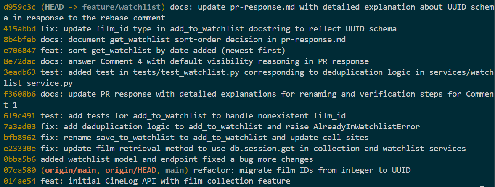

# PR Response Doc — CineLog Watchlist Feature

## AI Usage

I used Claude Code as a working assistant on this project. Specific uses:

- **Codebase orientation.** Before writing any watchlist code, I asked the AI to locate the existing collection feature and summarize its conventions, since the reviewer's comments repeatedly pointed at `add_to_collection()` / `get_collection()` as the pattern to mirror. This is how I found that `get_collection()` already sorts by `CollectionEntry.date_added.desc()` (which became the deciding argument in Comment 5) and how `add_to_collection()` handles deduplication (mirrored in Comment 2). I verified each claim by opening `services/collection_service.py` myself rather than taking the summary on faith.
- **Verifying commit-message format.** I had the AI check my commit messages against the Conventional Commits style already used in the repo's history (`fix:`, `docs:`) before committing.
- **Verifying the rebase reasoning (Comment 6).** I asked the AI to sanity-check that a clean rebase with no textual conflicts could still leave semantically stale references, which is what pointed me at the leftover integer-ID docstring. I then confirmed with `git grep -inE "integer|int\)"` myself.
- **Writing Assistance:** I used Claude Code to refine and polish my notes on pr-response.md.

**Comment 4 and Comment 5.** I used AI as a sounding board while drafting both arguments, but the substance is mine. For Comment 4 (default visibility) I asked the AI to argue the opposite position (privacy-by-default) so I could stress-test my own reasoning. It surfaced the "users may not expect saved films to be visible" objection, which I did not dismiss; I incorporated it as the explicit tradeoff I acknowledge (the per-entry, toggleable `public` flag is my answer to it). For Comment 5 (sort order), the AI's first-pass argument leaned entirely on the user-behavior point the reviewer had already made ("people want to see recent additions"). I judged that too weak on its own (it just restates the reviewer) so my final argument leads with codebase consistency (the `get_collection()` precedent) as the deciding factor and treats user behavior as secondary, plus adds the "watchlist is a queue of intent" framing that the AI did not propose.

## Comment 1 — Rename
**Comment on line R12 of `services/watchlist_service.py`:** `save_to_watchlist()` should follow the project's naming convention. Compare with `add_to_collection()` — the pattern here is `verb_to_noun`. Please rename to `add_to_watchlist()` and update all call sites.

**What I did:** Renamed `save_to_watchlist()` to `add_to_watchlist()` in `services/watchlist_service.py` and updated all call sites by conducting project-wide search of `save-to-watchlist` in VS Code to confirm no call sites are missed.

**How I verified:** Conducted project-wide search of `save_to_watchlist` in VS Code to confirm no call sites are missed. Ran `git grep -n save_to_watchlist` and `git grep -n add_to_watchlist` to enumerate the renamed definition plus its call sites.

## Comment 2 — Deduplication
**Comment on line R30 of `services/watchlist_service.py`:** What happens if a user calls this with a film that's already on their watchlist? The current implementation would add a duplicate entry. Please handle this case.

**What I did:** Added deduplication logic to `add_to_watchlist()` in `services/watchlist_service.py` by raising an `AlreadyInWatchlistError` with the message "Film '{film_id}' is already in this user's watchlist" if the film is already in the user's watchlist. Ensured pattern consistency by following the same pattern as `add_to_collection()` deduplication handling in `services/collection_service.py`.

**How I verified:** Wrote and ran `test_add_to_watchlist_duplicate_raises` test for `add_to_watchlist()` in `tests/test_watchlist.py` to ensure that adding the same film twice raises `AlreadyInWatchlistError`, not silently create a duplicate entry. Ran the full test suite `pytest tests/ -v` to confirm nothing is broken.

## Comment 3 — Missing test
**Comment:** Please add a test for the case where `film_id` doesn't exist in the database. Look at the existing tests in `test_collection.py` — the pattern is there.

**What I did:** Created a new file `tests/test_watchlist.py`. Wrote `test_add_to_watchlist_nonexistent_film_raises` test for `add_to_watchlist()` to ensure `FilmNotFoundError` is raised when adding a film_id that doesn't exist in the database. Followed the same fixture and assertion structure as `test_add_to_collection_nonexistent_film_raises` in `tests/test_collection.py`.

**How I verified:** Ran the test `pytest tests/test_watchlist.py -v` to confirm it passes. Ran the full test suite `pytest tests/ -v` to confirm nothing is broken.

## Comment 4 — Default visibility
**Comment:** I notice watchlists default to `public=True`. We don't have a documented decision on default visibility for user lists. Before I can approve this, I need you to add a note to your PR description explaining your reasoning. I want to make sure we're being intentional here, not just inheriting a default.

**My position:** Watchlists should default to `public=True`

**Reasoning:** A watchlist is social, signalling a "films I want to watch" list so that users can interact with each other based on their interests and find new films more easily. Thus, it is meant to be shared and discovered. Making it public by default supports the discovery/recommendation use cases the feature is intended for. The data exposed is low-sensitivity, not private account information.

**Tradeoff acknowledged:** Public-by-default is less conservative than privacy-by-default. Some users may not expect their saved films to be visible to others. I am accepting that tradeoff because the public column is per-entry and can be toggled, so users retain control. Moreover, discoverability is a core goal of the watchlist feature.

## Comment 5 — Sort order
**Comment on line R50 of `services/watchlist_service.py`:** I'd prefer watchlists to default to "date added" order rather than alphabetical. Most users want to see what they added recently. I'm open to discussion if you see it differently — but let's make a decision and document it.

**My position:** I agree with the maintainer, watchlists should default to "date added" order, newest first. I changed `get_watchlist()` in `services/watchlist_service.py` from `order_by(Film.title.asc())` to `order_by(WatchlistEntry.date_added.desc())`.

**Reasoning:** In addition to the maintainers's user-behavior point, the deciding factor for me is codebase consistency. `get_collection()` in `services/collection_service.py` already sorts by `CollectionEntry.date_added.desc()`. Watchlist and collection are sibling features that users will see side by side, so having one default to recency and the other to alphabetical is a surprising inconsistency. Aligning the watchlist with the established collection convention makes the two features behave predictably and removes a divergence a future reader would otherwise have to explain.

**Engagement with reviewer's point:** The reviewer's argument is that most users want to see what they added recently, and I think that is right for this feature specifically. The main case for alphabetical is lookup (finding a known title in a long list) but that is better served by search/filter than by default sort order, and it's a weaker fit for a watchlist than for, say, a reference catalog. On top of that, a watchlist is inherently a queue of intent ("things I mean to get to"), and recency is the more meaningful signal for a queue than title — the film I just added is the one most likely to be on my mind.

## Comment 6 — Rebase
**Comment:** A refactor merged to `main` that changed film IDs from integers to UUIDs. Your watchlist code still references integer IDs. Please rebase on `main` and update accordingly.

**What conflicted:** I ran `git fetch origin` then `git rebase origin/main`, which reported "Successfully rebased and updated." No automatic merge conflicts occurred, because my changes and the new commits on `main` did not touch the same lines. However, the UUID concern still applied: `services/watchlist_service.py` had a stale docstring describing `film_id (int): ID of the film. (Note: integer — pre-refactor)`, a leftover from before the schema moved to UUIDs.

**How I resolved it:** The models already use UUIDs (`db.Column(db.String(36), ..., default=generate_uuid)` in `models.py`), so the runtime code was already UUID-correct. I updated the stale docstring in `services/watchlist_service.py` to `film_id (str): UUID of the film.` so the documentation matches the UUID-based schema.

**How I verified no conflict remains:** Confirmed the branch is linear with `git log --oneline --graph --merges origin/main..HEAD`, which returned no output (no merge commits). Also verified via `git grep -inE "integer|int\)" -- models/ services` that no remaining code or docs reference integer IDs.

## Screenshot of `git --no-pager log --oneline`



## PR Description
<!-- Written at the end — feature overview, design decisions, manual testing steps -->

### Watchlist Feature Overview

Lets a user keep a personal watchlist of films. A user can view their watchlist and add films to it through a REST endpoint. Adding a film that's already on the list is rejected at the data layer, so a film never appears twice for the same user. The watchlist is returned newest-added first.

### Design Decisions

- **Default Visibility:** Set to `public=True` to encourage social engagement and community discovery across the platform, with a future-proofing acknowledgement of user privacy toggles (the public flag is per-entry and can be toggled).
- **Sort Order:** Implemented a default sort by `date_added` (descending) so users always see their newest additions first, matching modern streaming platform standards and staying consistent with how the sibling collection feature sorts.

### Manual Testing Steps

1. Seed a user and a film (writes to `cinelog.db`):

    ```
    python
    >>> from app import create_app, db
    >>> from models import User, Film
    >>> app = create_app()
    >>> with app.app_context():
    ...     u = User(username="testuser", email="test@example.com")
    ...     f = Film(title="Paddington 2", year=2017, genre="Comedy")
    ...     db.session.add_all([u, f]); db.session.commit()
    ...     print("USER_ID:", u.id, "FILM_ID:", f.id)
    ```

    Note the printed USER_ID and FILM_ID.

2. Start the app (PowerShell):
    
    `$env:FLASK_APP = "app"; flask run`

    App serves on `http://127.0.0.1:5000`.

3. View the empty watchlist, expect []:

    `curl.exe http://127.0.0.1:5000/watchlist/<USER_ID>`

4. Add a film, expect `201` and the new entry (`public: true`):

    `curl.exe -X POST http://127.0.0.1:5000/watchlist/<USER_ID>/add -H "Content-Type: application/json" -d "{\"film_id\": \"<FILM_ID>\"}"`

5. View again, the film appears, newest-first:

    `curl.exe http://127.0.0.1:5000/watchlist/<USER_ID>`

6. Add the same film again: deduplication prevents a second entry (re-running step 5 still shows the film only once).